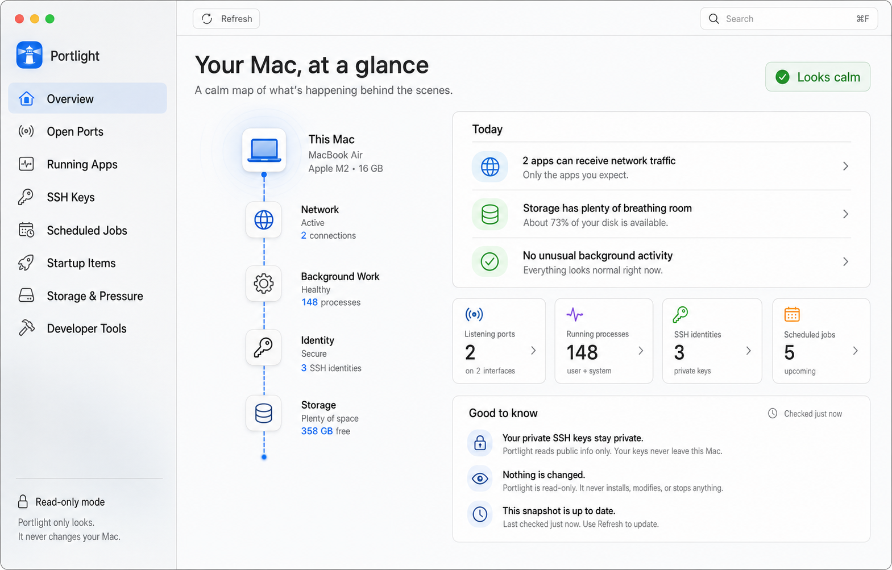

# Portlight

A friendly, read-only macOS control center for understanding what is running behind the scenes.



Portlight shows:

- apps listening on network ports, with local-vs-network visibility
- running processes and their CPU/memory use
- SSH public keys and safe fingerprints (never private key contents)
- launch agents and cron jobs
- third-party and macOS startup items
- storage headroom, memory pressure, model, and uptime
- installed developer tools and versions
- a compact menu bar health view with one-click access to the full app

The overview translates all of that into a plain-English backstage map and a short “Today” briefing. The app is deliberately read-only: it never stops processes, changes jobs, edits keys, or modifies system settings.

## Run it

```bash
swift run Portlight
```

## Build a macOS app bundle

```bash
./scripts/build-app.sh
open dist/Portlight.app
```

The generated app is unsigned and intended for local development.

## Install with Homebrew

```sh
brew install --cask Takhoffman/tap/portlight
```

Release builds are Developer ID signed and notarized by Apple.

## Privacy

Portlight does not collect analytics, connect to a server, or send your system information anywhere. It runs local read-only commands and reads public metadata available to your macOS account. Private SSH-key contents, passwords, tokens, and environment secrets are never read or displayed.

## Requirements

- macOS 14 Sonoma or newer
- Apple silicon Mac for the downloadable preview build

## Product principles

- Explain first; expose jargon only where it helps.
- Show whether a port is local-only or network-facing.
- Never read or display private SSH key contents.
- Keep potentially destructive controls out of the first release.
- Use native SwiftUI, SF Symbols, keyboard shortcuts, accessibility labels, and macOS materials.

## License

Portlight is open source under the [MIT License](LICENSE).
